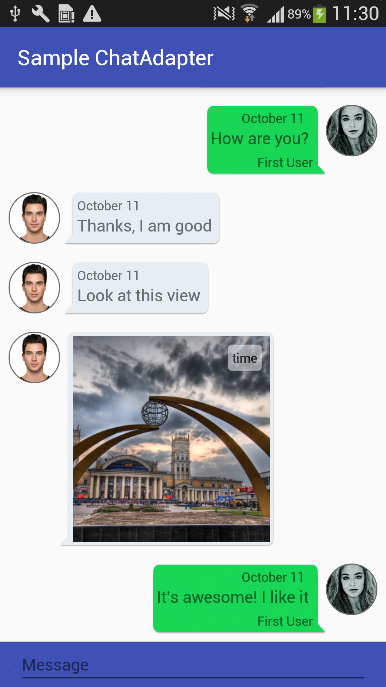
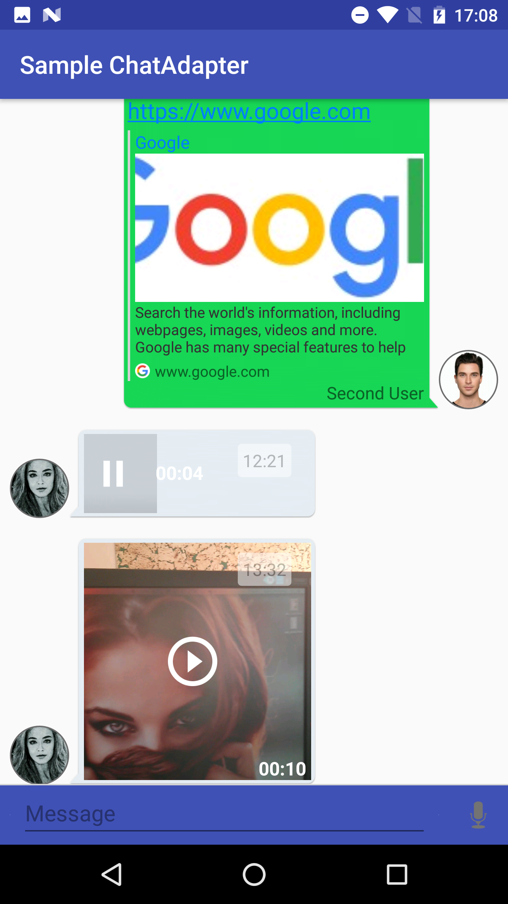

# ChatMessagesAdapter for Android
QuickBlox simple to use UI library for showing quickblox chat messages inside android application. 

#Features
- Ready-to-go QBChatMessage view adapter with a set of view types.
- UI customisation for all message types.
- Flexibility in improving and extending functionality.
- Easy to connect with Quickblox.
- Optimised and performant.
- Flexible mechanism for styling layout for chat messages.
- Add custom widgets inside predefined layout.

# Screenshots

&nbsp;


# Dependencies
Just add to your build.gradle
```xml
dependencies {

compile 'com.quickblox:chat-message-adapter:2.0'

}
```
# Getting started
Example is included in repository. Try it out to see how chat message adapter works.  
For now QBMessagesAdapter works with [RecycleView](https://developer.android.com/reference/android/support/v7/widget/RecyclerView.html).

The following code example demonstrates how to add the QBMessagesAdapter to show chat messages:

 - Include [RecycleView](https://developer.android.com/reference/android/support/v7/widget/RecyclerView.html) into activity layout:
```xml
<!-- A RecyclerView with some commonly used attributes -->
<android.support.v7.widget.RecyclerView
    android:id="@+id/list_chat_messages"
    android:scrollbars="vertical"
    android:layout_width="match_parent"
    android:layout_height="match_parent"/>
```
 - Once you have added a RecyclerView widget to your layout, get it and attach a QBMessagesAdapter for the data to be displayed:
```java
   public class ChatActivity extends AppCompatActivity {

   private RecyclerView messagesListView;
   private QBMessagesAdapter chatAdapter;

   private List<QBChatMessage> messages = ..;

    @Override
    public void onCreate(Bundle savedInstanceState) {
        super.onCreate(savedInstanceState);
        setContentView(R.layout.activity_chat);
        
        messagesListView = (RecyclerView) findViewById(R.id.list_chat_messages);

        //retrieve messages from storage and set to adapter
        chatAdapter = new QBMessagesAdapter(ChatActivity.this, messages);

        LinearLayoutManager layoutManager = new LinearLayoutManager(ChatActivity.this, VERTICAL, false);
        messagesListView.setLayoutManager(layoutManager);
        messagesListView.setAdapter(chatAdapter);
    }
```

Steps to customize QBMessagesAdapter to your Chat app:

1. Create a subclass of QBMessagesAdapter.
2. In your subclass define and override methods that you need (such as displayAvatarImage() and obtainAvatarUrl()).
3. Also you can adjust predefined styles for the next:
```xml
  * size of the avatar image view
  * message view container size
  * attachment view container size
  * bubble background for message
  * for all layouts and views set paddings, margins, etc.
```

## Main listeners

Chat Adapter main event listeners.
```java
QBChatMessageLinkClickListener - interface used to handle Clicks and Long clicks on the TextView and taps on the phone, web, mail links inside of TextView.
QBChatAttachClickListener - interface used to handle Clicks on any attachments: image, location, audio, video.
```
Usage:
```java
messagesAdapter.setAttachLocationClickListener(new QBChatAttachClickListener{

        @Override
        public void onLinkClicked(QBAttachment qbAttachment, int i) {
            MapsActivity.start(context, qbAttachment.getData());
        }
    });

messagesAdapter.setMessageTextViewLinkClickListener(messagesTextViewLinkClickListener, false);
messagesAdapter.setAttachImageClickListener(imageAttachClickListener);
```

## Style configuration
  
**ChatMessagesAdapter** has a flexible configuration system for displaying any view elements. For example:

To change bubble for left side opponent you can just create
```xml
    <style name="BubbleTextFrame.Left">
        <item name="android:background">@drawable/left_bubble</item>
    </style>
```
To change Avatar cell size
```xml
    <style name="AvatarImageViewStyle.Left">
        <item name="android:layout_width">@dimen/image_view_small_avatar_layout_width</item>
        <item name="android:layout_height">@dimen/image_view_small_avatar_layout_height</item>
    </style>
```
To change some margin or padding
```xml
    <style name="ImageViewAttach.Left">
        <item name="android:layout_marginLeft">@dimen/padding_common</item>
    </style>
```

Some styles namespaces:
 * BubbleTextFrame (Right or Left) - for LinearLayout in widget text message with background bubble, that includes timetext, msgtext, widget views
 * BubbleAttachFrame (Right or Left) - for RelativeLayout in item attach with background bubble, that includes progressbar, image, timetext views
 * AvatarImageViewStyle (Right or Left) - for avatar CircleImageView
 * ListItemTextMessage (Right or Left) - for item text message MessageTextView
 * ListItemAttachMessage (Right or Left) - for item attach message
 * ProgressBarAttach (Right or Left) - for progressbar in attach
 * ImageViewAttach (Right or Left) - for image in attach
 * TextViewAttach (Right or Left) - for text in attach<br />
 <br />
 * WidgetTextMsgFrame - style for main FrameLayout text message
 * LinearTextMsgFrame - style for LinearLayout that includes all text message views
 
##Configure QBMessagesAdapter
You can modify layout resource files, that used in QBMessagesAdapter by creating them with the same namespaces.

In addition, you can add your own widget, just create the layout resource file.  
For example, create layout with namespace `list_item_text_right` with any layout, e.g. `text_widget_owner`:
```xml
<com.quickblox.ui.kit.chatmessage.adapter.widget.MessageTextViewRight
    xmlns:android="http://schemas.android.com/apk/res/android"
    xmlns:custom="http://schemas.android.com/apk/res-auto"

    android:id="@+id/msg_message_text_view_right"
    style="@style/ListItemTextMessage.Right"
    custom:widget_id="@layout/text_widget_owner">

</com.quickblox.ui.kit.chatmessage.adapter.widget.MessageTextViewRight>
```

Then you can extends QBMessagesAdapter and define your own logic for every item view - plain text message, message with attachment or your custom item view:
```java
    @Override
    protected void onBindViewMsgRightHolder(TextMessageHolder holder, QBChatMessage chatMessage, int position) {
        //update logic for showing your own plain text message
        TextView view = (TextView) holder.itemView.findViewById(R.id.custom_text_view);
        view.setText(currentUser.getFullName());
        super.onBindViewMsgRightHolder(holder, chatMessage, position);
    }
```
```java
    @Override
    protected void onBindViewMsgLeftHolder(TextMessageHolder holder, QBChatMessage chatMessage, int position) {
        super.onBindViewMsgLeftHolder(holder, chatMessage, position);
        //update logic for showing plain text message from opponent
    }
```
```java
    @Override
    protected void onBindViewAttachLeftHolder(ImageAttachHolder holder, QBChatMessage chatMessage, int position) {
        super.onBindViewAttachLeftHolder(holder, chatMessage, position);
        //update logic for showing message with image attachment from opponent
    }
```

There are 8 predefined view types:
 - TYPE_TEXT_RIGHT
 - TYPE_TEXT_LEFT
 - TYPE_ATTACH_RIGHT
 - TYPE_ATTACH_LEFT
 - TYPE_ATTACH_RIGHT_AUDIO
 - TYPE_ATTACH_LEFT_AUDIO
 - TYPE_ATTACH_RIGHT_VIDEO
 - TYPE_ATTACH_LEFT_VIDEO


To create your own non predefined view type for chat message use code:

* Define custom view type for position
```java
    @Override
    protected int customViewType(int position) {
        return MY_VIEW_TYPE;
    }
```  
* Create view holder for item:
```java
    @Override
    protected QBMessageViewHolder onCreateCustomViewHolder(ViewGroup parent, int viewType) {
        if (MY_VIEW_TYPE == viewType) {
            // create ViewHolder by your own
        }
        return yourViewHolder;
    }
```  
* Fill your own view type with chat message data use code:
```java
    @Override
    protected void onBindViewCustomHolder(QBMessageViewHolder holder, QBChatMessage chatMessage, int position) {
        // here you will receive your own ViewHolder    
    }
```


Also you can override methods to display attach images
```java
    @Override
    protected void displayAttachment(QBMessageViewHolder holder, int position) {
       super.displayAttachment(holder, position);
       ...add own logic
    }
```
override methods to display avatars
```java
    @Override
    public void displayAvatarImage(String url, ImageView imageView) {
       ...
    }

    @Override
    public String obtainAvatarUrl(int valueType, QBChatMessage chatMessage) {
        return currentUser.getId().equals(chatMessage.getSenderId()) ?
                currentUserData.getUserAvatar() : opponentUserData.getUserAvatar();
    }
```
and etc.

## Audio and video attachment integration.

Starting from version 2.0 ***ChatAdapter*** has ability to record audio attachment, a.k.a. - voice message.  
AudioRecorder is intended for this purpose. Just use it like this:
```java
        audioRecorder = AudioRecorder.newBuilder()
                // Required
                .useInBuildFilePathGenerator(this) // or setFilePath(filePath)
                .build();
                // Optional
//                .setDuration(10)
//                .setAudioSource(MediaRecorder.AudioSource.MIC)
//                .setOutputFormat(MediaRecorder.OutputFormat.MPEG_4)
//                .setAudioEncoder(MediaRecorder.AudioEncoder.AAC)
//                .setAudioSamplingRate(44100)
//                .setAudioChannels(CHANNEL_STEREO)
//                .setAudioEncodingBitRate(96000)
        audioRecorder.setMediaRecordListener(new QBMediaRecordListener());
	...
	audioRecorder.startRecord();
```
and listen events with QBMediaRecordListener
```java
public interface QBMediaRecordListener {

    void onMediaRecorded(File file);

    void onMediaRecordError(MediaRecorderException e);

    void onMediaRecordClosed();
}
```
QBRecordAudioButton - custom view which extends ImageButton. This view has RecordTouchEventListener:
 ```java
    public interface RecordTouchEventListener {
        void onStartClick(View view);

        void onCancelClick(View view);

        void onStopClick(View view);
}
```
It is convenient way to make voice record. Just set setRecordTouchListener:
 ```java
 recordButton.setRecordTouchListener(new RecordTouchListenerImpl());
 ...
         @Override
         public void onStartClick(View view) {
            audioRecorder.startRecord();
         }
 ```
 
 To record Video, for example you can use:
  ```java
 new Intent(MediaStore.ACTION_VIDEO_CAPTURE);
 ```

ChatAdapter has audio and video preview integration and can play these kind attachments using ExoPlayer library.  
VideoPlayerActivity - simple implementation for playing video attachments. To use it just declare VideoPlayerActivity in your AndroidManifest.xml file.

QBPlaybackControlView - custom control view for playback audio attachments, which extends PlaybackControlView from ExoPlayer.


## Location attachment integration.

Starting from version 1.1.0 ***ChatAdapter*** has ability to create location JSON, that represents such fields as lat and lng:
```java
	"attachments":[
            {
               "type":"location",
               "data":"{\"lat\":\"50.014141\",\"lng\":\"36.229058\"}"
            }
         ]
```
This means you can generate json location like this:
```java
double latitude = 50.014141;
double longitude = 36.229058;
String location = LocationUtils.generateLocationJson(new Pair<>("lat", latitude),
                            new Pair<>("lng", longitude));
```
And then create attachment:
```java
QBAttachment attachment = new QBAttachment("location");
attachment.setData(location);
...
chatMessage.addAttachment(attachment);
```

After receiving message with location ***ChatAdapter*** generates locationUrl type of google static maps api, to show it like an image.

***Note, you should set google_static_maps_key in string resource(https://developers.google.com/maps/documentation/static-maps/) like this:***
```java
    <string name="google_static_maps_key" templateMergeStrategy="preserve" translatable="false">
        YOUR_KEY
    </string>
```

Then by clicking this item, using ***QBChatAttachLocationClickListener***, you can get latitude and longitude to show it in your MapActivity:
```java
	String receivedLocation = attachment.getData();
	// latitude - latLngPair.first, longitude - latLngPair.second
	Pair<Double, Double> latLngPair = LocationUtils.getLatLngFromJson(receivedLocation);
```

Besides, ***LocationUtils*** has defaultUrlLocationParams for location URI and it can be customized with LocationUtils.BuilderParams(), or can be changed just some parameters in string resource:
```java
    <string name="map_zoom">15</string>
    <string name="map_size">600x300</string>
    <string name="map_type">roadmap</string>
    <string name="map_color">blue</string>
```


## Link preview customisation
### Simple customization
This chat adapter displays preview only for first link in message. If message contains only link, message's text will be hidden and link
preview will be displayed. If message contains few links, link preview will be displayed only for first link and other links will be
displayed as message text.

If you want to simple customize view for displaying link previews (change place, position of views etc.), you can create layout resource file
```widget_link_preview.xml``` in your module and fill it with views with next ids:
- ```link_preview_image``` - displays main image for link (type ImageView);
- ```link_preview_title``` - displays title of link (type TextView);
- ```link_preview_description``` - displays description of link (type TextView);
- ```link_host``` - displays host of link (type TextView);
- ```link_host_icon``` - displays host icon of link (type ImageView).

In this way your layout resource file ```widget_link_preview.xml``` must contain all this ids.

If you want use only separated ids, you should override method
```fillLinkPreviewLayout(View linkPreviewLayout, QBLinkPreview linkPreview, String link)``` for setting data to your views.

For configuration default views we prepared some styles:
* LinkPreviewFrame (Right or Left) - for LinearLayout in widget text message with background bubble, that includes link title, link image, link description, host icon and host URL
* LinkPreviewVerticalLine - for vertical line in link preview
* LinkPreviewTitle - for title of link
* LinkPreviewImage - for image of link
* LinkPreviewDescription - for description of link
* HostView - for LinearLayout in widget link preview, that includes host icon and host URL
* HostViewIcon - for image of host
* HostViewUrl - for text with host URL

### Full customization
If you want fully customize link preview with own views, you should set your own custom view to ```MessageTextViewLeft``` and
```MessageTextViewRight``` (in example we use layout file with name ```custom_widget_link_preview.xml```):
```xml
<?xml version="1.0" encoding="utf-8"?>
<com.quickblox.ui.kit.chatmessage.adapter.widget.MessageTextViewLeft
    xmlns:android="http://schemas.android.com/apk/res/android"
    xmlns:custom="http://schemas.android.com/apk/res-auto"

    android:id="@+id/msg_message_text_view_left"
    style="@style/ListItemTextMessage.Left"
    custom:widget_id_link_preview="@layout/custom_widget_link_preview">

</com.quickblox.ui.kit.chatmessage.adapter.widget.MessageTextViewLeft>
```
Then need override method ```processLinksFromMessage(final TextMessageHolder holder, final List<String> urlsList, final int position)```.
in this method you can find own view from parameter ```hollder```:
```java
    View customView = holder.linkPreviewLayout;
```

Sure, you can use separated views for right side bubbles (own messages) and for left side bubbles (opponent's messages).
For it need set different layouts for ```MessageTextViewLeft``` and ```MessageTextViewRight```. For example:
```xml
<!--  for left link previews-->
custom:widget_id_link_preview="@layout/custom_widget_link_preview_left"

<!--  for right link previews-->
custom:widget_id_link_preview="@layout/custom_widget_link_preview_right"
```
Then need override methods ```processLinksFromLeftMessage(TextMessageHolder holder, List<String> urlsList, int position)``` and
```processLinksFromRightMessage(TextMessageHolder holder, List<String> urlsList, int position)``` for

# License
See [LICENSE](LICENSE)
